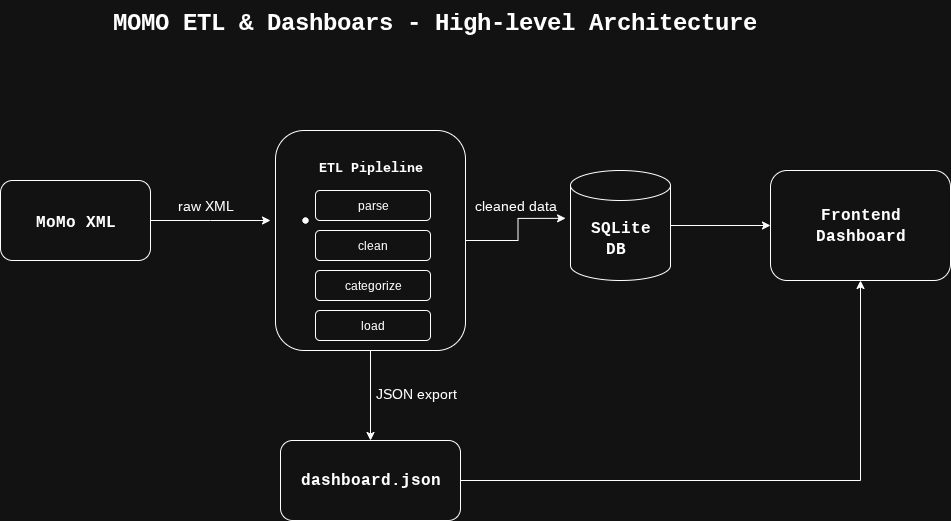

# Project Description
This project is a **MoMo SMS Data Analysis Tool** that processes MoMo SMS XML data through an ETL pipeline—parsing, cleaning, categorizing, and storing in a SQLite database—and provides a frontend dashboard for data visualization and analysis.

# Team Information:
Team Name: Data Raiders

Team members:
- Albert NIYONSENGA- Github Repository Master & Initial Scaffolder 

- Sonia UMUBYEYI BAYINGANA - System Architect

- Beulla RUGERO - Scrum Master

- Selena ISIMBI- Documentation Lead

# Key features:

XML data parsing and extraction

Data cleaning and normalization

Transaction categorization

SQLite database storage

Dashboard with data visualization

RESTful API (bonus feature)

# Project Links 
Architecture Diagram: View System Architecture 

Scrum Board: View Project Progress
You can track our tasks here: [MoMo Scrum Board](https://github.com/users/brugero/projects/2/views/1)

# Project Structure
text
.
├── README.md                         # Project overview and setup instructions
├── .env.example                      # Environment variables template
├── requirements.txt                  # Python dependencies
├── index.html                        # Main dashboard page
├── web/
│   ├── styles.css                    # Dashboard styling
│   ├── chart_handler.js              # Data fetching and visualization
│   └── assets/                       # Images and icons
├── data/
│   ├── raw/                          # Original XML files (gitignored)
│   │   └── momo.xml
│   ├── processed/                    # Processed data for frontend
│   │   └── dashboard.json
│   ├── db.sqlite3                    # SQLite database file
│   └── logs/
│       ├── etl.log                   # ETL process logs
│       └── dead_letter/              # Unprocessable data
├── etl/
│   ├── __init__.py
│   ├── config.py                     # Configuration settings
│   ├── parse_xml.py                  # XML parsing logic
│   ├── clean_normalize.py            # Data cleaning functions
│   ├── categorize.py                 # Transaction categorization
│   ├── load_db.py                    # Database operations
│   └── run.py                        # Main ETL script
├── api/                              # Optional API component
│   ├── __init__.py
│   ├── app.py                        # FastAPI application
│   ├── db.py                         # Database connection helpers
│   └── schemas.py                    # Pydantic models
├── scripts/
│   ├── run_etl.sh                    # ETL execution script
│   ├── export_json.sh                # JSON export script
│   └── serve_frontend.sh             # Frontend server script
└── tests/
    ├── test_parse_xml.py             # XML parsing tests
    ├── test_clean_normalize.py       # Cleaning tests
    └── test_categorize.py            # Categorization tests
Getting Started
# Prerequisites
Python 3.8 or higher

pip (Python package manager)

# Installation
Clone the repository: https://github.com/brugero/MoMo.git

bash
git clone https://github.com/brugero/MoMo.git
cd momo-analyzer
Install dependencies:

bash
pip install -r requirements.txt
Set up environment variables:

bash
cp .env.example .env
# Edit .env with your configuration
Usage
Run the ETL process:

bash
python etl/run.py --xml data/raw/momo.xml
Start the frontend server:

bash
python -m http.server 8000
Open your browser and navigate to http://localhost:8000

# Running Tests
Execute the test suite with:

bash
python -m pytest tests/
Development Process
Our team follows Agile methodology with:

# Weekly sprints

Scrum meetings every Monday, Wednesday, and Friday

Task tracking on our Scrum board

Continuous integration and testing

# Contributing
Fork the repository

Create a feature branch (git checkout -b feature/amazing-feature)

Commit your changes (git commit -m 'Add amazing feature')

Push to the branch (git push origin feature/amazing-feature)

Open a Pull Request

# License
This project is licensed under the MIT License - see the LICENSE file for details.

# Acknowledgments
Thanks to our instructor for guidance on this project

Inspired by real-world financial data processing systems

Built with open-source technologies and libraries
